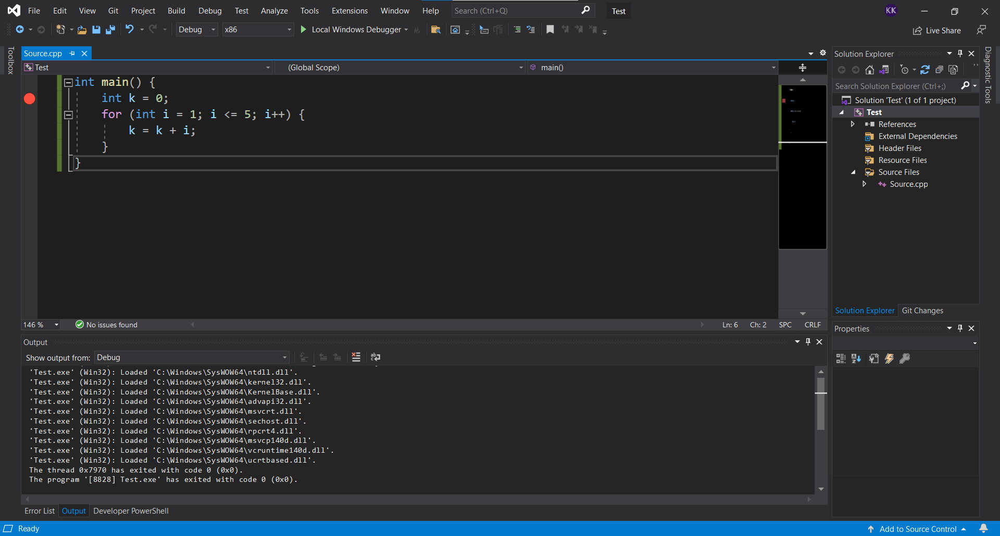
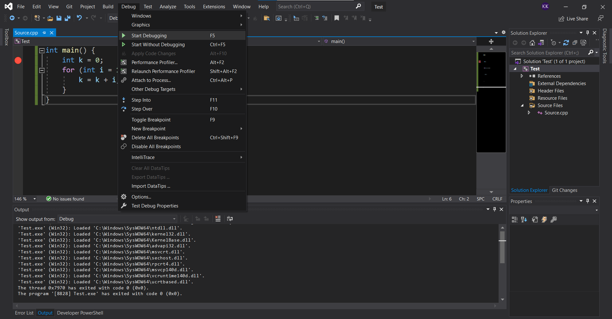
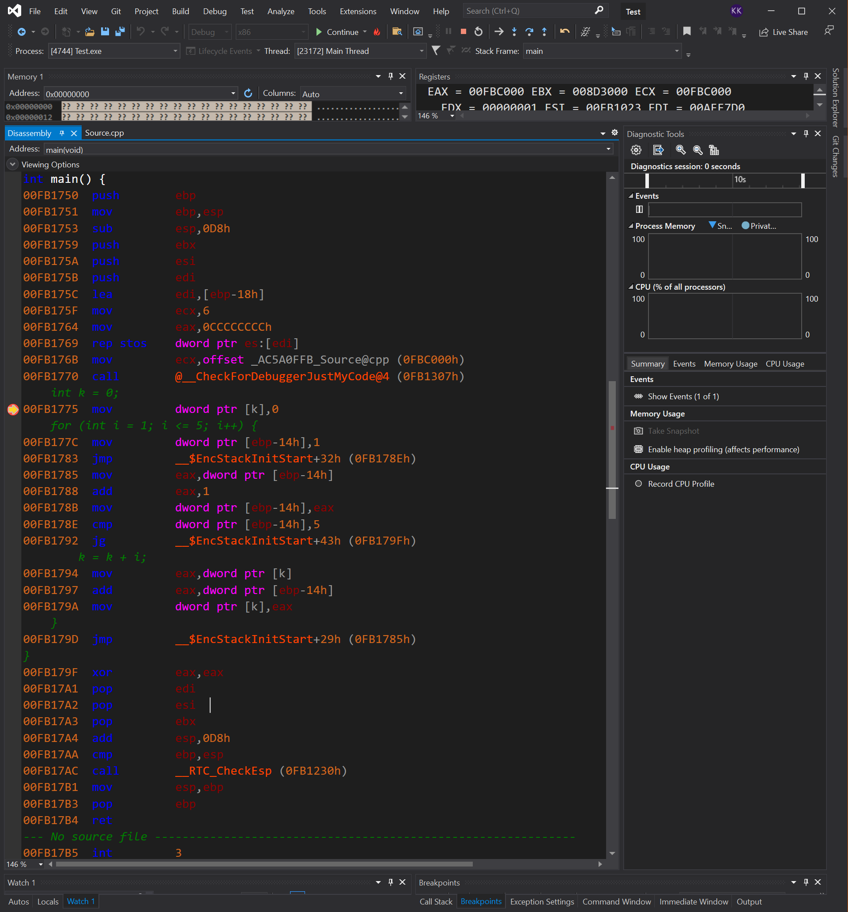

# Generating Assembly from a High Level Language

## General Example
How might one implement the high-level language (HLL) code block shown below (python) in assembly? 

### High-Level Language (Python)
```python
op1 = 5
op2 = 10

if op1 == op2:
    x = 1
else:
    x = 2
```

### Assembly (x86 MASM code)
```assembly
.data
op1	DWORD	5
op2	DWORD	10

.code
  MOV   EAX, op1
  CMP   EAX, op2
  JNE   _NotEqual
  MOV   x, 1        ; Operands equal
  JMP   _Finished
_NotEqual:          ; Operands not equal
  MOV   x, 2  
_Finished:
```

## C Example in Ubuntu 20.04

### Compiling and Generating Assembly with GCC

To compile to executable:
```console
gcc <fname>.c -o <fname>
```

To run the executable:
```console
./<fname>
```

To generate the assembly file:
```console
gcc -S <fname>.c
```

### Examples with C / GCC

#### Example 1 - Flow Control

**Code in C**
```C
int main(void)
{
  int op1 = 5;
  int op2 = 10;
  int x;
  if (op1 == op2) {
    x = 1;
  } else {
    x = 2;
  } 
}
```

**GCC Generated Assembly File**
```assembly
	.file	"demo_ifelse.c"
	.text
	.globl	main
	.type	main, @function
main:
.LFB0:
	.cfi_startproc
	endbr64
	pushq	%rbp
	.cfi_def_cfa_offset 16
	.cfi_offset 6, -16
	movq	%rsp, %rbp
	.cfi_def_cfa_register 6
	movl	$5, -12(%rbp)
	movl	$10, -8(%rbp)
	movl	-12(%rbp), %eax
	cmpl	-8(%rbp), %eax
	jne	.L2
	movl	$1, -4(%rbp)
	jmp	.L3
.L2:
	movl	$2, -4(%rbp)
.L3:
	movl	$0, %eax
	popq	%rbp
	.cfi_def_cfa 7, 8
	ret
	.cfi_endproc
.LFE0:
	.size	main, .-main
	.ident	"GCC: (Ubuntu 9.4.0-1ubuntu1~20.04.1) 9.4.0"
	.section	.note.GNU-stack,"",@progbits
	.section	.note.gnu.property,"a"
	.align 8
	.long	 1f - 0f
	.long	 4f - 1f
	.long	 5
0:
	.string	 "GNU"
1:
	.align 8
	.long	 0xc0000002
	.long	 3f - 2f
2:
	.long	 0x3
3:
	.align 8
4:
```

**Focusing just on the important bits...**

Note that:
* x : -4(%rbp)
* prop1 : -12(%rbp)
* prop2 : -8(%rbp)

```assembly
...
.LFB0:
	...
	movl	$5, -12(%rbp)
	movl	$10, -8(%rbp)
	movl	-12(%rbp), %eax
	cmpl	-8(%rbp), %eax
	jne	.L2
	movl	$1, -4(%rbp)
	jmp	.L3
.L2:
	movl	$2, -4(%rbp)
.L3:
	movl	$0, %eax
	popq	%rbp
	.cfi_def_cfa 7, 8
	ret
	.cfi_endproc
...
```

#### Example 2 - Repetition Structures

**Code in C**
```C
int main(void)
{
  int sum = 0;
  for (int i = 1; i < 11; i++) {
    sum += i;
  }
}
```

**GCC Generated Assembly File**
```assembly
	.file	"demo_repetition.c"
	.text
	.globl	main
	.type	main, @function
main:
.LFB0:
	.cfi_startproc
	endbr64
	pushq	%rbp
	.cfi_def_cfa_offset 16
	.cfi_offset 6, -16
	movq	%rsp, %rbp
	.cfi_def_cfa_register 6
	movl	$0, -8(%rbp)
	movl	$1, -4(%rbp)
	jmp	.L2
.L3:
	movl	-4(%rbp), %eax
	addl	%eax, -8(%rbp)
	addl	$1, -4(%rbp)
.L2:
	cmpl	$10, -4(%rbp)
	jle	.L3
	movl	$0, %eax
	popq	%rbp
	.cfi_def_cfa 7, 8
	ret
	.cfi_endproc
.LFE0:
	.size	main, .-main
	.ident	"GCC: (Ubuntu 9.4.0-1ubuntu1~20.04.1) 9.4.0"
	.section	.note.GNU-stack,"",@progbits
	.section	.note.gnu.property,"a"
	.align 8
	.long	 1f - 0f
	.long	 4f - 1f
	.long	 5
0:
	.string	 "GNU"
1:
	.align 8
	.long	 0xc0000002
	.long	 3f - 2f
2:
	.long	 0x3
3:
	.align 8
4:
```


**Focusing just on the important bits...**

Note that:
* sum : 	-8(%rbp)
* i   : 	-4(%rbp)
```assembly
.LFB0:
	.cfi_startproc
	endbr64
	pushq	%rbp
	.cfi_def_cfa_offset 16
	.cfi_offset 6, -16
	movq	%rsp, %rbp
	.cfi_def_cfa_register 6
	movl	$0, -8(%rbp)
	movl	$1, -4(%rbp)
	jmp	.L2
.L3:
	movl	-4(%rbp), %eax
	addl	%eax, -8(%rbp)
	addl	$1, -4(%rbp)
.L2:
	cmpl	$10, -4(%rbp)
	jle	.L3
	movl	$0, %eax
	popq	%rbp
	.cfi_def_cfa 7, 8
	ret
	.cfi_endproc
```


## C++ Example in Windows with Visual Studio
You can also access/view the assembly code in Visual Studio via the debugger. Just set a breakpoint and open the dissasembly window when execution of the program is paused. 

Set a breakpoint.


Start debugging from Debug dropdown, or hit F5.


Open the Dissassembly window to view the assembly code.



C++ Code
```C++
int main() {
	int k = 0;
	for (int i = 1; i <= 5; i++>) {
		k = k + i;
	}
}
```

Dissasembly Output
```assembly
00FB174F  int         3  
--- C:\Users\kkuei\Downloads\Test\Test\Source.cpp ------------------------------
int main() {
00FB1750  push        ebp  
00FB1751  mov         ebp,esp  
00FB1753  sub         esp,0D8h  
00FB1759  push        ebx  
00FB175A  push        esi  
00FB175B  push        edi  
00FB175C  lea         edi,[ebp-18h]  
00FB175F  mov         ecx,6  
00FB1764  mov         eax,0CCCCCCCCh  
00FB1769  rep stos    dword ptr es:[edi]  
00FB176B  mov         ecx,offset _AC5A0FFB_Source@cpp (0FBC000h)  
00FB1770  call        @__CheckForDebuggerJustMyCode@4 (0FB1307h)  
    int k = 0;
00FB1775  mov         dword ptr [k],0  
    for (int i = 1; i <= 5; i++) {
00FB177C  mov         dword ptr [ebp-14h],1  
00FB1783  jmp         __$EncStackInitStart+32h (0FB178Eh)  
00FB1785  mov         eax,dword ptr [ebp-14h]  
00FB1788  add         eax,1  
00FB178B  mov         dword ptr [ebp-14h],eax  
00FB178E  cmp         dword ptr [ebp-14h],5  
00FB1792  jg          __$EncStackInitStart+43h (0FB179Fh)  
        k = k + i;
00FB1794  mov         eax,dword ptr [k]  
00FB1797  add         eax,dword ptr [ebp-14h]  
00FB179A  mov         dword ptr [k],eax  
    }
00FB179D  jmp         __$EncStackInitStart+29h (0FB1785h)  
}
00FB179F  xor         eax,eax  
00FB17A1  pop         edi  
00FB17A2  pop         esi  
00FB17A3  pop         ebx  
00FB17A4  add         esp,0D8h  
00FB17AA  cmp         ebp,esp  
00FB17AC  call        __RTC_CheckEsp (0FB1230h)  
00FB17B1  mov         esp,ebp  
00FB17B3  pop         ebp  
00FB17B4  ret  
--- No source file -------------------------------------------------------------
00FB17B5  int         3  
```


## References and Other Additional Reading
* [Programming Process: compiled vs. interpreted, and java](http://www2.hawaii.edu/~takebaya/ics111/process_of_programming/process_of_programming.html#:~:text=A%20compiler%20takes%20the%20program,to%20create%20an%20executable%20file.)
* [Do programming language compilers first translate to assembly or directly to machine code?](https://stackoverflow.com/questions/845355/do-programming-language-compilers-first-translate-to-assembly-or-directly-to-mac)
* [Does a compiler always produce an assembly code?](https://stackoverflow.com/questions/14039843/does-a-compiler-always-produce-an-assembly-code)
* [How to compile and run a C/C++ program](https://www.cyberciti.biz/faq/howto-compile-and-run-c-cplusplus-code-in-linux/)
* [Assembler output from C/C++](https://stackoverflow.com/questions/137038/how-do-you-get-assembler-output-from-c-c-source-in-gcc)
* [Writing a Compiler, Part 1](https://norasandler.com/2017/11/29/Write-a-Compiler.html)
* [How to Write your Own Compiler, Part 1](https://visualstudiomagazine.com/articles/2014/05/01/how-to-write-your-own-compiler-part-1.aspx)
* [How to write a very basic compiler](https://softwareengineering.stackexchange.com/questions/165543/how-to-write-a-very-basic-compiler)
* [Building your own programming Language from Scratch](https://hackernoon.com/building-your-own-programming-language-from-scratch)
* [GNU GCC](https://en.wikipedia.org/wiki/GNU_Compiler_Collection)
* [LLVM](https://en.wikipedia.org/wiki/LLVM)
